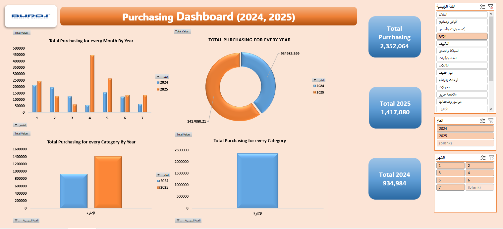

# 🧾 Purchase Performance 2024 vs 2025 (Excel)

## 🎥 Demo Video
[▶ Watch the demo](purchasing.mp4)

---

## 📘 Project Summary
This Excel-based analysis compares purchasing data from **January to July** for **2024 vs. 2025**.  
The dataset contains **100K+ rows**, requiring extensive cleaning, validation, and restructuring prior to analysis.

## 🔎 Main Focus Areas
- Comparison of total purchases between 2024 and 2025  
- Supplier-level performance and identification of major cost drivers  
- Year-over-year spending analysis to highlight procurement trends and efficiency  
- Data cleaning, type validation, and dataset structuring

## 📈 Methods & Deliverables
- Dynamic pivot tables and pivot charts.  
- Interactive dashboard elements and slicers in Excel.  
- Conditional formatting to highlight key values.  
- Final visual report ready for sharing with stakeholders.

---

## 🎯 Project Objective
The main goal of this report is to **enhance purchasing visibility and support data-driven decisions** by simplifying performance tracking, identifying cost drivers, and improving overall procurement efficiency.

---

## ⚠️ Disclaimer
The data used in this project is **simulated** to resemble company records for demonstration purposes.  
It does **not** contain real or sensitive company data.
